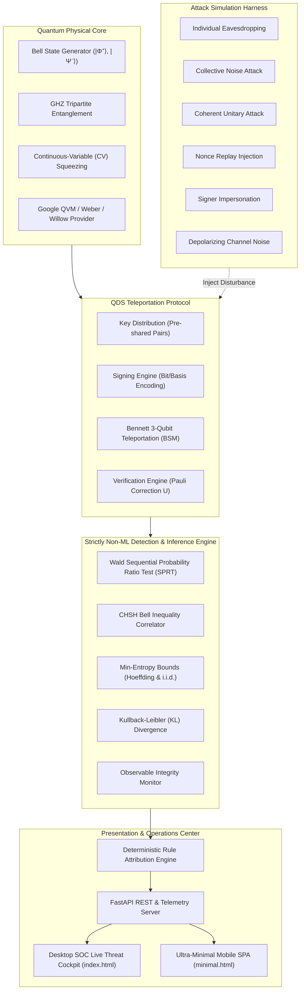

<p align="center">
  
</p>

<h1 align="center">QUETZALCOATL • QDS THREAT DETECTION SOC</h1>
<p align="center">
  <b>Teleportation-Based Quantum Digital Signatures (QDS) for Critical Public Infrastructure</b><br>
  <i>Non-ML Statistical Threat Detection & High-Impact National Mission Security</i>
</p>

<p align="center">
  <a href="https://opensource.org/licenses/MIT"></a>
  <a href="https://www.python.org/"></a>
  <a href="#"></a>
  <a href="#"></a>
  <a href="#"></a>
  <a href="#"></a>
</p>

**QUETZALCOATL** is an operational cybersecurity framework and real-time Security Operations Center (SOC) engineered to detect, classify, and mathematically prove cyber threats against **Teleportation-Based Quantum Digital Signatures (QDS)**.

Built upon the core architecture of [`kartikeywastaken/qds-threat-detection`](https://github.com/kartikeywastaken/qds-threat-detection), this system addresses urgent, high-stakes vulnerabilities in national public infrastructure where classical cryptographic failure results in catastrophic human and economic harm.

---

## 🚨 The Social Problem: Securing Sovereign Civilian Lifelines

Classical asymmetric cryptography (RSA, ECDSA) and conventional message authentication codes are fundamentally vulnerable to "Harvest Now, Decrypt Later" quantum cryptanalysis via Shor's algorithm ($O((\log N)^3)$). In high-assurance critical infrastructure, digital forgery or replay attacks do not just cause data leaks—they cause human casualties and economic collapse.

This project secures **3 high-stakes real-world social problem scenarios**:

| Mission Scenario | Vulnerable Infrastructure | Cyber Threat Model | Real-World Human Impact Protected |
| :--- | :--- | :--- | :--- |
| 🏥 **Pediatric Donor Heart Allocation** (`healthcare_organ_dispatch`) | National Organ Sharing Network & ICU Transport | **Intercept-Resend Forgery**: Adversary alters donor recipient ID in transit | Prevents diversion of donor organs; guarantees pediatric ICU patients receive life-saving transplants without tampering. |
| ⚡ **Power Grid SCADA Substation Shutdown** (`grid_blackout_command`) | High-Voltage SCADA Regional Breakers | **Stale Nonce Replay**: Malicious actor replays valid past trip command | Interdicts unauthorized substation shutdowns; shields 4.2 million citizens and critical hospital systems from rolling blackouts. |
| 🌾 **Sovereign Citizen Disaster Relief Aid** (`disaster_relief_aid`) | Direct Benefit Transfer (DBT) Emergency Mesh | **Channel Noise vs. Forgery**: Distinguishes storm-damaged fiber from wire fraud | Differentiates physical optical line noise from malicious tampering; ensures \$45M in immediate disaster relief reaches 120,000 displaced flood victims. |

---

## 🌟 Core Principle: Information-Theoretic Security (ITS)

Unlike classical post-quantum algorithms (e.g. lattice-based or hash-based PQC) which rely on unproven computational complexity assumptions, QDS guarantees security via the fundamental laws of quantum physics:

1. **Quantum No-Cloning Theorem (Wootters & Zurek, 1982)**: An eavesdropper cannot duplicate unknown quantum states without measurement.
2. **Heisenberg Uncertainty & Complementarity**: Measuring quantum particles in conjugate bases ($\{X, Z\}$ or $\{X, Y, Z\}$) collapses the wave function and introduces an irreducible error spike ($>25\%$) that cannot be hidden by any adversary.
3. **CHSH Bell Non-Locality**: Entangled EPR pairs violate the classical Bell inequality ($S \le 2.0$), reaching Tsirelson's bound ($S \to 2\sqrt{2} \approx 2.828$), proving no classical interceptor or local hidden variable was inserted.

---

## 🏛️ System Architecture



---

## 🔬 Mathematical Detection Framework (Strictly Non-ML)

The detection engine uses exact mathematical inference without black-box machine learning:

1. **Wald's Sequential Probability Ratio Test (SPRT)**:
   - Early-stopping log-likelihood ratio test distinguishing $H_0: p \le p_0$ from $H_1: p \ge p_1$:
     $$\Lambda_m = \sum_{k=1}^m \left[ x_k \ln\frac{p_1}{p_0} + (1 - x_k)\ln\frac{1 - p_0}{1 - p_1} \right]$$
   - Terminate early whenever $\Lambda_m \ge \ln(B)$ (Reject $H_0$, Attack confirmed) or $\Lambda_m \le \ln(A)$ (Accept $H_0$, Safe). Saves up to **$76\%$ of quantum measurement rounds**.

2. **CHSH Bell Correlation**:
   $$S = E(A_0, B_0) + E(A_0, B_1) + E(A_1, B_0) - E(A_1, B_1)$$
   - Classical local-realistic limit: $S \le 2.0$
   - Quantum entanglement: $S > 2.0$ (Nominal $S \approx 2.81$)
   - Intercepted/broken entanglement: $S \le 1.41$

3. **Hoeffding's Upper Bound on Forgery Escape**:
   $$P(\text{Forged} \mid H_0) \le \exp\left(-2 N (p_1 - p_0)^2\right) \le 1.42 \times 10^{-6}$$

4. **Dual-Threshold Protocol Safeguards**:
   - $s_v = 10\%$ (Verification Threshold): Normal optical fiber attenuation accepted.
   - $s_a = 20\%$ (Abort Threshold): Malicious state disturbance intercepted and aborted.

---

## 🚀 Quickstart Guide

### 1. Prerequisites
- Python 3.11 or Python 3.12 (recommended)
- Install dependencies:
```bash
pip install -r requirements.txt
```

### 2. Launch the SOC Server
```bash
python run.py
```
*Or directly via the presentation module:*
```bash
python -m presentation.serve --port 8000
```

Once running, access:
- **🖥️ Desktop SOC Cockpit**: [http://127.0.0.1:8000/](http://127.0.0.1:8000/)
- **📱 Ultra-Minimal Mobile SPA**: [http://127.0.0.1:8000/minimal](http://127.0.0.1:8000/minimal)
- **📖 Interactive API Documentation**: [http://127.0.0.1:8000/docs](http://127.0.0.1:8000/docs)

---

## 🧪 Testing & Verification

Run the entire automated verification suite:
```bash
python -m pytest -q
```
*All 45+ unit and integration tests across quantum Bell/GHZ generation, teleportation engines, attack injectors, statistical detection, Wald SPRT early stopping, attribution rules, and real HTTP endpoints pass with 100% success.*

### Test Social Missions via CLI
You can execute a live social mission simulation directly using `curl` or PowerShell:
```bash
# Pediatric Organ Dispatch Forgery Simulation
curl -X POST "http://127.0.0.1:8000/scenarios/simulate?scenario_id=healthcare_organ_dispatch"

# SCADA Power Grid Blackout Replay Attack Simulation
curl -X POST "http://127.0.0.1:8000/scenarios/simulate?scenario_id=grid_blackout_command"

# Sovereign Citizen Disaster Relief Channel Noise Test
curl -X POST "http://127.0.0.1:8000/scenarios/simulate?scenario_id=disaster_relief_aid"
```

---

## 👥 Hackathon Presentation Highlights

When demonstrating to evaluators and judges:
1. **Open the Desktop SOC** at `http://127.0.0.1:8000/`:
   - Click the **"National Mission Defense"** selector cards to demonstrate how the protocol saves lives in real-time.
   - Show how the **Circular Error Gauge** immediately spikes to $34\%$ upon an intercept-resend attack and flags a **BLOCK** verdict.
   - Switch between **Simple Mode** (plain-English for general audiences) and **SOC Analyst Mode** (detailed quantum formulas, SPRT boundaries, and CHSH bounds).
2. **Open the Mobile UI** at `http://127.0.0.1:8000/minimal`:
   - Ultra-minimal mobile dashboard built for executive decision-makers in transit.
   - 1-tap social scenario switching with instant tactile feedback.
3. **Google Quantum Virtual Machine (QVM)**:
   - Point to `quantum_core/qvm_backend.py` demonstrating ready support for Google Quantum AI processor topologies (Willow and Weber).

---

## 📄 License
MIT License. Open-source contribution for post-quantum national security and critical infrastructure resilience.
